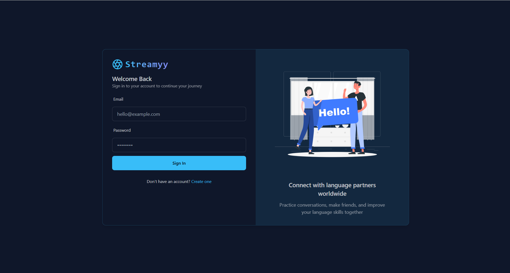
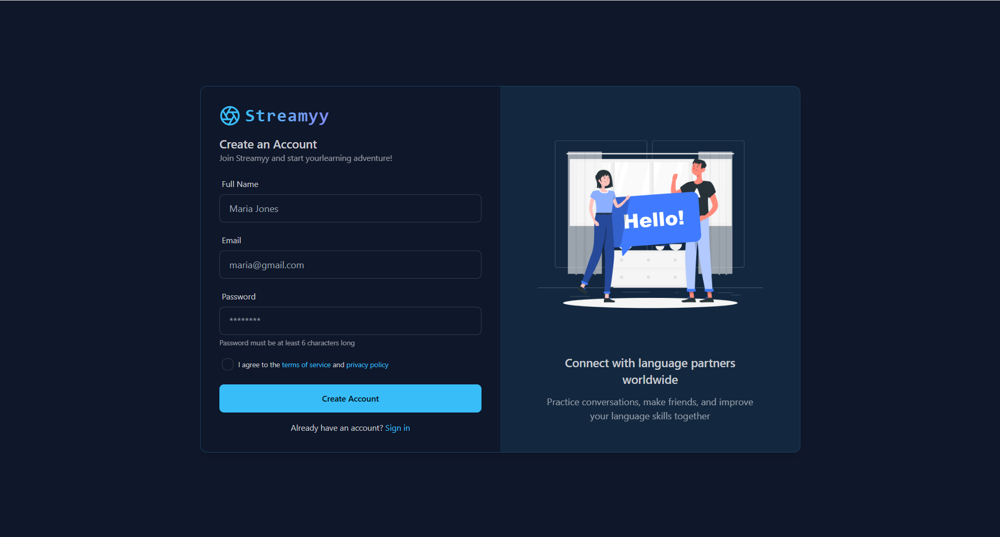
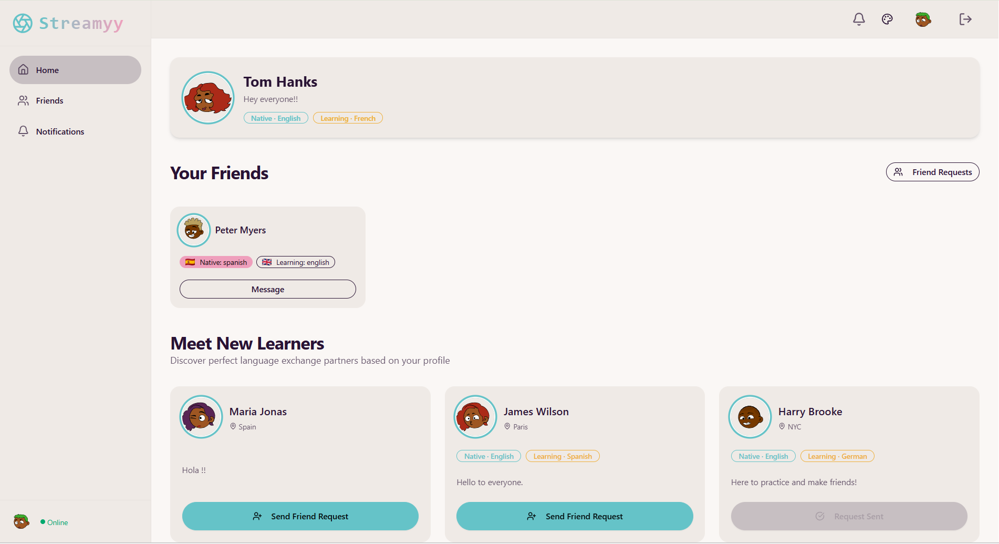
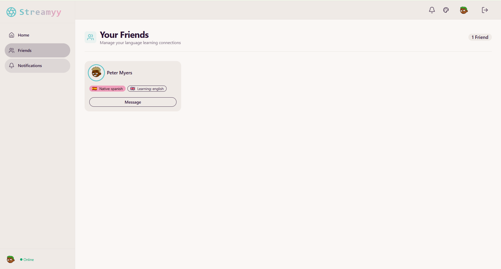
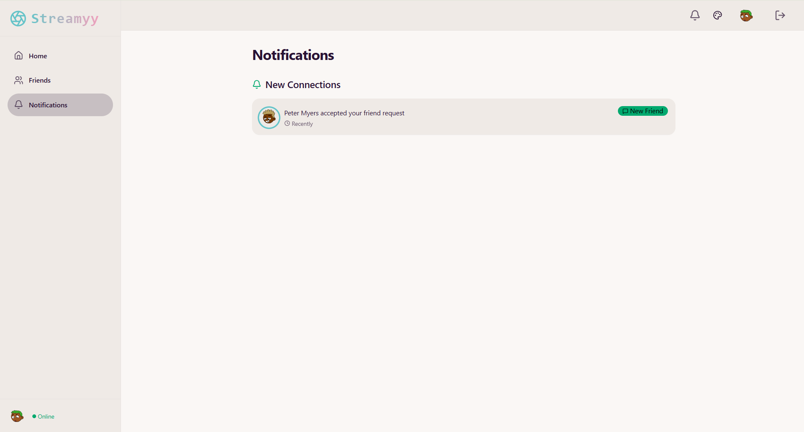
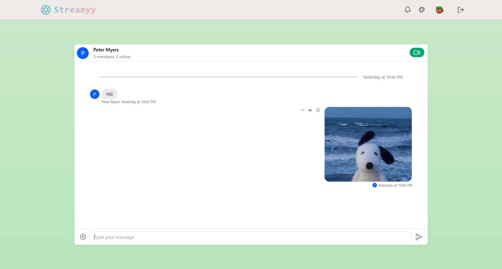

# 🌐 Streamyy

**Streamyy** is a modern, real-time social platform dedicated to language learning and exchange. It connects language learners worldwide, enabling them to discover partners, engage in real-time text chat, and practice through high-quality video calls.

---

## 🚀 Key Features

### 👤 User Experience
- **Secure Authentication**: Robust login/signup system using JWT and HTTP-only cookies.
- **Personalized Onboarding**: Tailored experience where users set their native languages, learning goals, and interests.
- **Dynamic Avatars**: Automatic profile picture generation using the **DiceBear API**.

### 🤝 Social Connectivity
- **Smart Discovery**: A recommendation system that helps you find new language partners based on your profile.
- **Friend Management**:
  - Send and receive friend requests.
  - View all your connections in a dedicated **Friends Page**.
  - **Defriend Support**: Safely remove connections when needed.
- **Real-time Notifications**: A bell icon with a live request count badge keeps you updated on new interactions.

### 💬 Communication
- **Real-time Chat**: Seamless 1:1 messaging powered by **Stream Chat SDK**.
- **Video Calling**: High-performance video calls integrated directly into chat using **Stream Video SDK**.
- **Theme Customization**: Support for multiple UI themes (Light/Dark+) via **DaisyUI**.

---

## 🛠️ Technology Stack

### **Frontend**
- **Framework**: React 19 (Vite)
- **Styling**: Tailwind CSS & DaisyUI
- **State Management**: Zustand
- **Data Fetching**: TanStack Query (React Query)
- **SDKs**: Stream Chat & Video SDKs

### **Backend**
- **Runtime**: Node.js (Express)
- **Database**: MongoDB (Mongoose)
- **Authentication**: JWT & BcryptJS
- **Communication**: Stream Server SDK

---

## 📂 Project Structure

```text
streamyy/
├── backend/                # Express.js Server
│   ├── src/
│   │   ├── controllers/    # Auth, User, and Chat logic
│   │   ├── models/         # User and FriendRequest schemas
│   │   ├── routes/         # API Endpoints
│   │   └── server.js       # Main entry point
├── frontend/               # React.js Client
│   ├── src/
│   │   ├── components/     # UI Components (Navbar, Sidebar, etc.)
│   │   ├── hooks/          # Custom Hooks (useAuth, useFriendRequests)
│   │   ├── pages/          # Full-page views
│   │   └── App.jsx         # Routing & Core Layout
└── package.json            # Deployment & build scripts
```

---

##  Screenshots 

### Login Page


### SignUp Page


### Landing Page


### Friends Page


### Authentication


### Notifications Page


### Chats Page


---

## ⚙️ Setup & Installation

### Prerequisites
- [Node.js](https://nodejs.org/) (v18+)
- [MongoDB](https://www.mongodb.com/) (Local or Atlas)
- [Stream.io](https://getstream.io/) Account (for Chat/Video API)

### 1. Clone & Install
```bash
git clone https://github.com/ishwari-03/streamyy.git
cd streamyy
npm install
cd backend && npm install
cd ../frontend && npm install
```

### 2. Environment Variables
Create `.env` files in both the `frontend` and `backend` directories:

**Backend (`backend/.env`):**
```env
PORT=5000
MONGO_URI=your_mongodb_uri
JWT_SECRET=your_jwt_secret
STREAM_API_KEY=your_stream_key
STREAM_API_SECRET=your_stream_secret
NODE_ENV=development
```

**Frontend (`frontend/.env`):**
```env
VITE_STREAM_API_KEY=your_stream_key
VITE_BASE_URL=http://localhost:5000/api
```

### 3. Running the Project
From the root directory:

**Development (Run both simultaneously):**
- Terminal 1: `cd backend && npm run dev`
- Terminal 2: `cd frontend && npm run dev`

```


